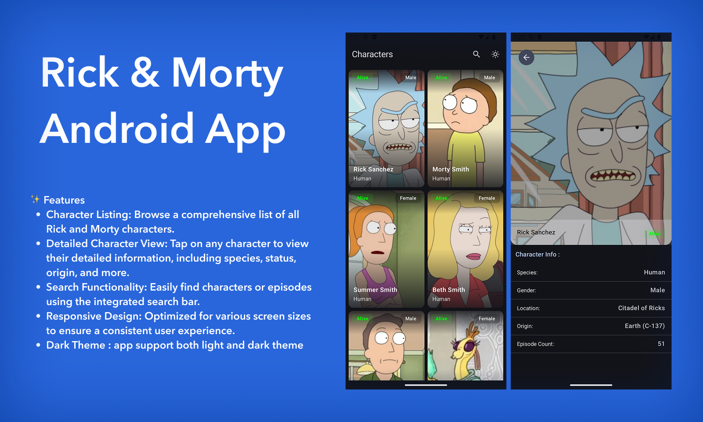
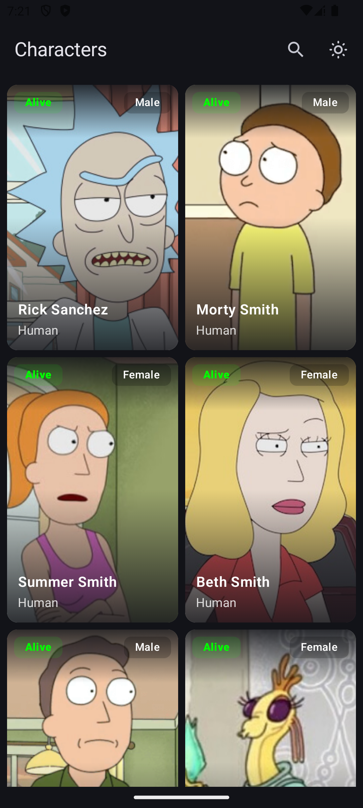
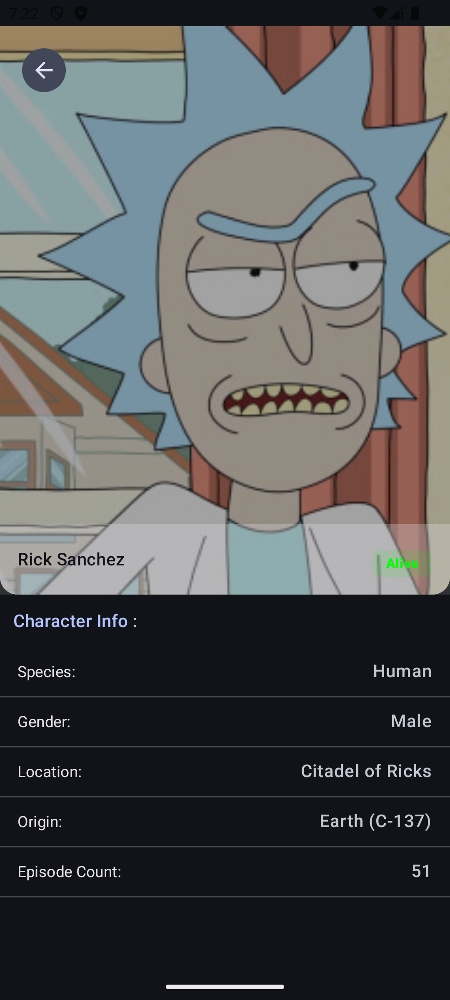

# Rick & Morty Android Application

An Android application built using **Jetpack Compose**, **Kotlin**, and the [Rick and Morty Api](https://rickandmortyapi.com/). The app displays characters, and locations from the Rick and Morty universe using Kotlin, Navigation, Retrofit, Hilt, ViewModel, Coroutines, Compose, Glide, based on MVVM architecture

## Features
- List of characters with images,names,species,status
- Details Screen with more information about each character
- pagination to load more characters on scroll
- MVVM architecture with clean separation of concerns
- Network calling using Retrofit

## 🧰 Tech Stack & Libraries Used
✅ Jetpack Compose  
✅ Kotlin  
✅ Kotlin Coroutines  
✅ Kotlin Flow  
✅ MVVM (Model-View-ViewModel)  
✅ Navigation Component  
✅ Retrofit (Network calls)  
✅ Glide (Image loading)  
✅ Dagger Hilt (Dependency Injection)  
✅ Paging 3 (Pagination)  
✅ Timber (Logging)  
✅ Lifecycle Components  
✅ Clean Architecture

## Architecture Overview
# MVVM
- **UI Layer (Jetpack Compose)**
    - Observes state and renders UI based on it
    - Triggers user interactions and events  .
- **ViewModel Layer**
    - Holds UI state
    - Fetches and transforms data
    - Handles UI-related business logic

- **Repository Layer**
    - Abstracts access to data sources
    - Coordinates data from network or local storage
- **Domain Layer**
    - Contains use cases
    - Acts as the bridge between ViewModel and Repository
    - Enforces business logic and reusability

- **Data Layer**
    - Implements data access via Retrofit
    - Maps API responses to domain models
    - Handles pagination


## Assumptions & Decisions
- Pagination done using Paging 3
- Error Handling includes Network failure message and retry option
- empty search result
- UI and theming follow material desing 3 guidlines using compose M3

## installation

1. **clone repository**
   ```bash
   https://github.com/ayoubdevv/RickAndMorty.git
   ```
2. **Open Android studio** :
   - New -> Project From Version Control
   - Past repository Link
   - Ok
3. **Sync & Run App**

## 📸 Screenshots



 

 